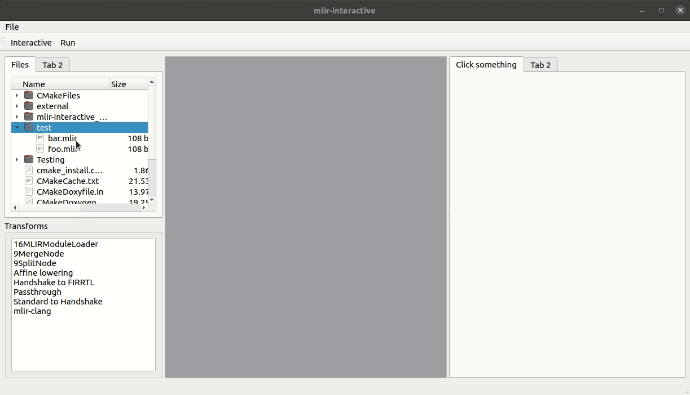

# mlir-interactive

Qt based UI for visual and interactive composition and execution of MLIR compilation flows.

**Note**: Current in very early stage of development. CIRCT is a hardcoded dependency and CIRCT passes are references through [main.cpp](main.cpp) and in [CMakeLists.txt](CMakeLists.txt). However, internal logic is solely dependent on MLIR/LLVM, and this project should be considered as a library for generating an interactive UI for _any_ MLIR-based compilation flow.
